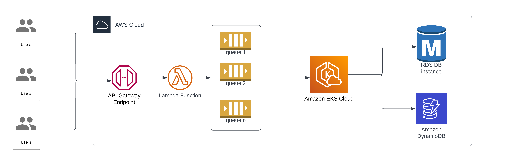

## Diagram

## Process Explanation

Following will be the process that will be carried forward. I have assumed in this case that the workload is coming from API Gateway, but the same can be achieved via replacing the input from an API Gateway to an S3 bucket, where a new path is a new workload. 

Essentially what is happening here is that for every workload/batch file processing, a new SQS queue is created which will hold the items to process, this queue creation and item addition inside of it will be taken care by the lambda function. Now, there is going to be a pod running inside the EKS, which will monitor SQS queue's and whenever a new queue is created it will understand that there is a new workload and it needs to be processes, then it will create Kuberentes Jobs which will scale depending upon the number of items in the queue. Now for each item that the job processes, it will store the state of it in a dynamoDB table, and in case of any errors faced during even processing a single item in the queue, it will roll back and not commit any changes to the datbabase. In case there are no issues, it will store everything in the database. The idea of using DynamoDB is that all the data can be set to expire as we will need a place to hold the data temporarily.

The EKS worker nodes can run on spot instances which would result in cost saving as well

## Questions Asked

1. How would you set up monitoring to identify bottlenecks as the load grows? - I would set up Cluster Monitoring either using Cloudwatch or using Prometheus and Grafana and monitor the available resources to the cluster. Depending on the processing, if it is a CPU intensive task then my monitoring would focus on creating proper alarms and autoscaling parameters keeping CPU utilization in mind. Another bottleneck that comes in mind are the total active connections that will be present at any given time for the database as there is a limit to that as well.

2. How can those bottlenecks be addressed in the future - Cluster AutoScaller will take care of the cluster running out of resources, also in the future dedicated nodegroups can be created for different kind of workloads. In case of Database Updates that lead from processing the batch can be stored in a queue and a seperate Lambda function is responsible for entering the data to the database.

3. The batch updates have started to become very large, but the requirements for their processing time are strict. - Due to the nature of the architecture, all workloads are taken care by different jobs, removing any dependency on each other, this will help in ensuring that all the jobs get completed at the expected time, also increasing the cluster configuration will be required in case the data is too large and need more resources.

4. Code updates need to be pushed out frequently. This needs to be done without the risk of stopping a data update already being processed, nor a data response being lost. - As we will be using Kuberentes Job, it will run unless the pod fails thus new updates to the code won't hamper the processing that is already taking place.

5. For development and staging purposes, you need to start up a number of scaled-down versions of the system. - We can create a Cloudformation/Terraform stack with the same architecture and create the same for development, as the only component here that needs to be scalled down is the EKS and the database. 

6. Which parts of the system are the bottlenecks or problems that might make it incompatible with the new requirements? - When in time when the input changes that will be the time creating the SQS queues with the data to process will be disrupted.

7. How would you restructure and scale the system to address those? - Changing the lambda function to handle the new kind of input will ensure that the system is working again without changing the other things.